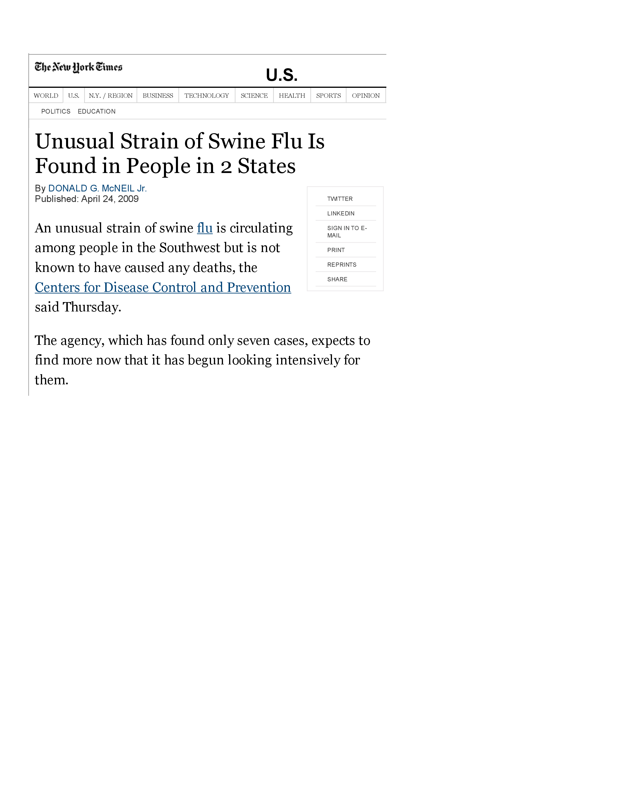
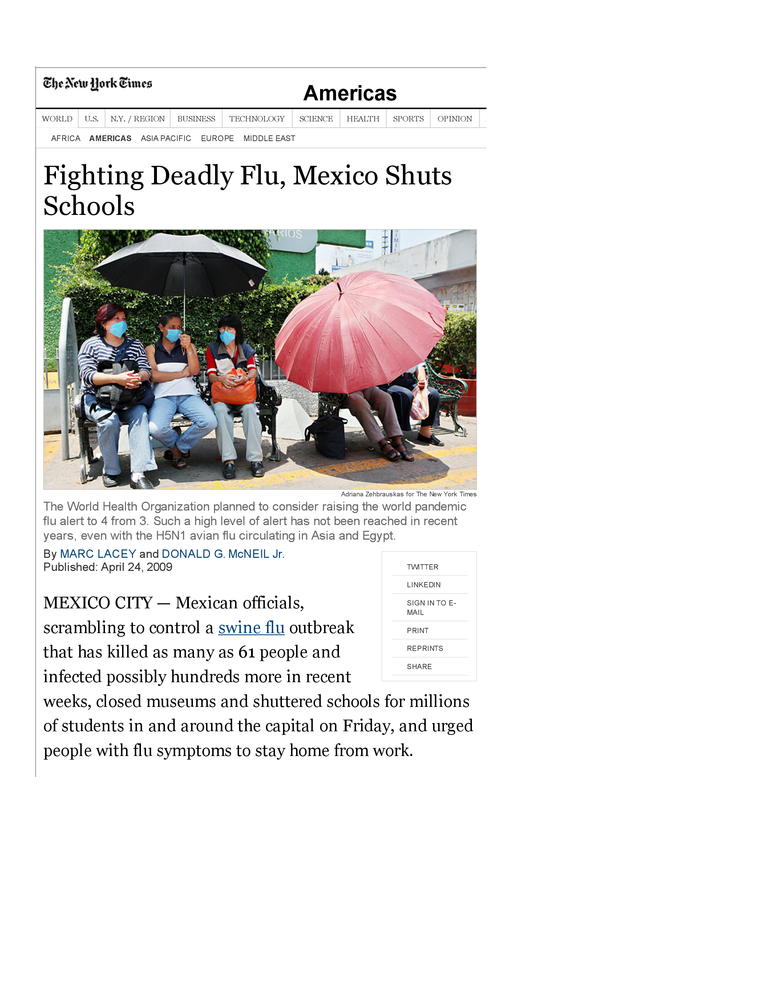
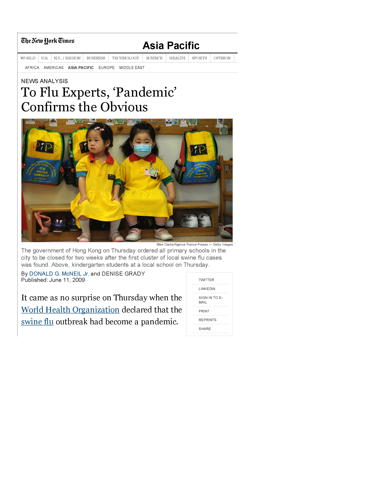

================================================================
Using phylogenetics to understand a virus pandemic 
================================================================

These slides are available at http://jbloom.github.io/FluPhylogeneticsModule/slides.html

Advance through the slides using the arrow keys.

These slides are for the high-school level class, and were created by `Jesse Bloom`_, `Trevor Bedford`_, and `Greg Ballog`_.

Studying a virus outbreak
============================
This lecture and homework will have you perform a simpler version of the studies that scientists performed to understand a virus outbreak that occurred in early 2009.

After you complete the lecture and homework, you can read about the similar but more complex analyses that scientists actually performed to study this virus outbreak by looking at `this paper <http://www.nature.com/nature/journal/v459/n7250/full/nature08182.html>`_ and `this website <http://tree.bio.ed.ac.uk/groups/influenza/>`_.

A new flu virus appears in the U.S.
======================================
On April 15, 2009, doctors in California detect a new strain of influenza in a 10-year old child. A few days later, a similar virus is found in another child in California.

A week later, the `Centers for Disease Control (CDC) <http://www.cdc.gov/>`_ publishes an `article in Morbidity and Mortality Weekly Report <http://www.cdc.gov/mmwr/preview/mmwrhtml/mm5815a5.htm>`_ describing these infections:

    *On April 17, 2009, CDC determined that two cases of febrile respiratory illness occurring in children who resided in adjacent counties in southern California were caused by infection with a swine influenza A (H1N1) virus. The viruses from the two cases are closely related genetically... and contain a unique combination of gene segments that previously has not been reported among swine or human influenza viruses in the United States or elsewhere.*

The virus spreads in the U.S.
======================================
On April 23, 2009, it is discovered that the virus has also infected people in Texas, as described in this `New York Times article <http://www.nytimes.com/2009/04/24/us/24flu.html>`_.

The virus is also in Mexico
======================================
It quickly becomes apparent that the virus is already circulating fairly extensively in Mexico, as described in this `New York Times article <http://www.nytimes.com/2009/04/25/world/americas/25mexico.html>`_.

The U.S. declares a public health emergency
==============================================
A few days later, the U.S. declares a health emergency, as described in this `New York Times article <http://www.nytimes.com/2009/04/27/world/27flu.html>`_.

The World Health Organization (WHO) declares a pandemic
=========================================================
Within six weeks, the virus has spread to at least 74 countries. The `WHO issues a declaration <http://www.who.int/mediacentre/news/statements/2009/h1n1_pandemic_phase6_20090611/en/>`_  that the virus is a `pandemic <http://en.wikipedia.org/wiki/Pandemic>`_, as reported in
this  `New York Times article <http://www.nytimes.com/2009/06/12/world/asia/12flu.html>`_.

Is the virus resistant to Tamiflu?
=========================================================

One of the first questions scientists asked was whether the virus was resistant to `Tamiflu (also known by the chemical name oseltamivir) <http://en.wikipedia.org/wiki/Oseltamivir>`_, which is the most commonly used drug against influenza.

Is the virus resistant to Tamiflu?
=========================================================

`Earlier studies <http://www.ncbi.nlm.nih.gov/pmc/articles/PMC2671453/>`_ had shown that influenza of this type was resistant if it had a mutation of from His to Tyr at position 275 of the virus's neuraminidase protein (this mutation is called *His275Tyr*).

So did the new 2009 pandemic virus have the *His275Tyr* mutation? To answer this question, we need to learn a little bit about influenza's genes.

Background on influenza's genes
=========================================================
Influenza is an `RNA virus <http://en.wikipedia.org/wiki/RNA_virus>`_ that encodes its genes in the `negative sense <http://en.wikipedia.org/wiki/Sense_(molecular_biology)#Negative-sense>`_. This means that its genes are made of RNA (rather than the DNA used to make our genes) that needs to be copied into mRNA (positive sense) before it can be translated into protein::

    viral RNA -> mRNA -> protein

Using this knowledge, we will look at the neuraminidase gene for the strain A/California/07/2009 to see if it contains the Tamiflu-resistance mutation *His275Tyr*.

Is the virus resistant to Tamiflu?
=========================================================

Use the portion of the sequence below for neuraminidase to see whether `virus A/California/07/2009 <http://www.ncbi.nlm.nih.gov/nuccore/507593927>`_ has *His275* (Tamiflu will work) or the resistance mutation *His275Tyr* (Tamiflu will not work). To go from viral RNA to mRNA, using the base-pair rules (*A - U* and *C - G*). To go from mRNA to protein, use the `genetic code <http://en.wikipedia.org/wiki/Genetic_code#RNA_codon_table>`_::

    viral RNA: 3'-...  cgg gga uua aua gug aua cuc cuu acg agg ...-5'
    mRNA:      5'-...  gcc ccu ??? ??? ??? ??? ??? ??? ??? ??? ...-3'
    protein:      ...  Ala ??? ??? ??? ??? ??? ??? ??? ??? ??? ...
    number:       ...  271 272 273 274 275 276 277 278 279 280 ...

**Exercise 1: Is this virus resistant to Tamiflu? If yes, what is a single-nucleotide mutation that would make it non-resistant? If no, what is a single-nucleotide mutation that would make it resistant?**

.. _`Jesse Bloom`: http://research.fhcrc.org/bloom/en.html
.. _`Trevor Bedford`: http://bedford.io/blog/
.. _`Greg Ballog`: http://www.sw.wednet.edu/page/581
